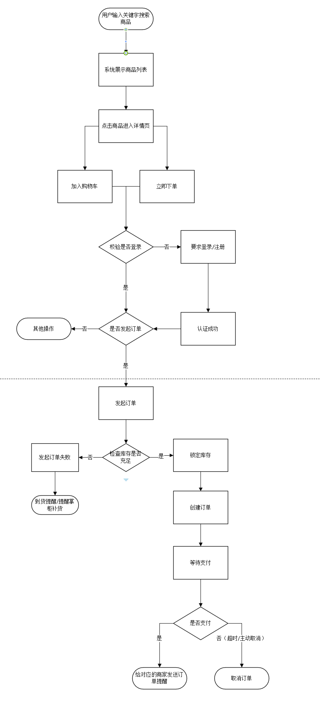
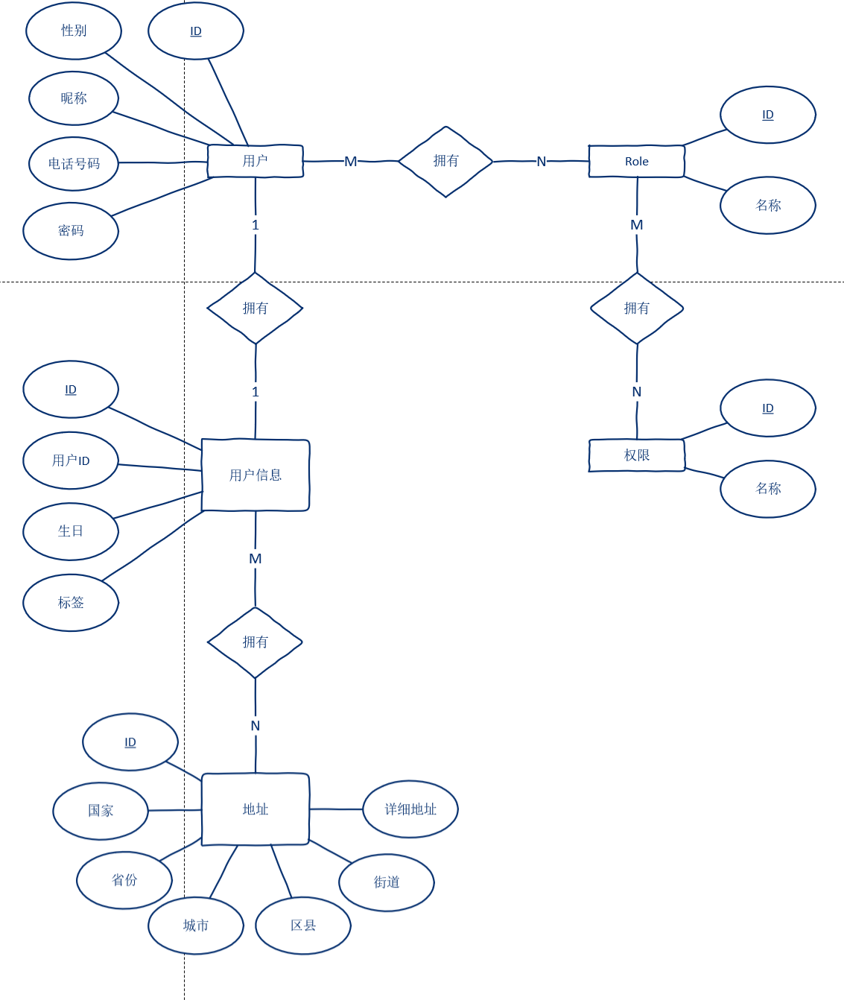
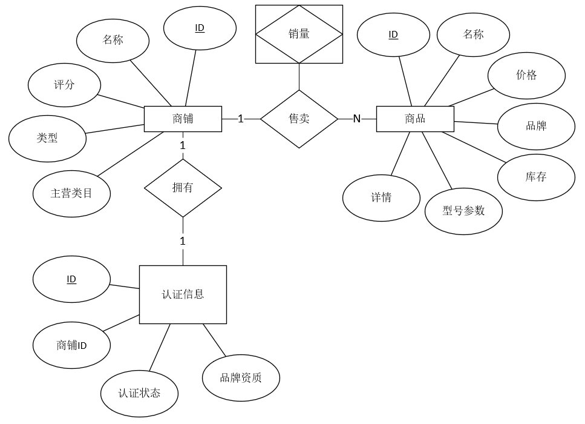

## 业务流程分析



## 服务划分

1. 网关服务
	1. 统一分发请求
	2. 统一认证鉴权
	3. 负载均衡
2. 用户服务
	1. 用户管理，增删查改
	2. 角色管理
	3. 权限管理
	4. 发送用户操作日志
3. 商铺服务
	1. 商铺管理
4. 商品服务
	1. 商品管理
5. 库存服务
	1. 库存管理
6. 订单服务
	1. 订单管理
7. 支付服务
	1. 提供支付接口
8. 日志服务
	1. 统一记录日志
	2. ELK

## ER图





## 技术栈

- [Spring Cloud Gateway](https://spring.io/projects/spring-cloud-gateway)：实现统一网关，负责路由转发、权限校验和请求过滤。
- [Nacos](https://nacos.io/)：作为服务注册中心和配置中心，实现服务发现与动态配置管理。
- [Sa-Token](https://sa-token.cc/index.html)：在网关处统一鉴权
- [Sentinel](https://sentinelguard.io/)：提供熔断、限流与降级功能，保障系统在高并发场景下的稳定性。
- [Seata](https://seata.apache.org/)：集成分布式事务管理，确保跨服务事务的一致性（如订单支付与库存扣减）。
- [RocketMQ](https://rocketmq.apache.org/)：通过消息队列实现异步处理和削峰填谷（如订单状态更新与库存同步）。
- [Docker](https://www.docker.com/)：对微服务进行容器化部署，提升环境一致性和快速扩展能力。
- [ElasticSearch](https://www.elastic.co/)：提高数据搜索能力，包括日志查询、商品查询、订单查询等。
- [Springfox]()：生成 API 文档，方便测试与编写文档

## 项目开发

### 依赖版本

从 [版本发布说明-Spring Cloud Alibaba](https://sca.aliyun.com/docs/2023/overview/version-explain/?spm=5176.29160081.0.0.74805c72PaDKHn) 可知 Spring  Cloud Alibaba（SCA）与其他组件对应的版本

在项目 pom.xml 文件中引入某版本的 SCA，随后 `Ctrl + 右键` 查看它定义的依赖版本。

> 官网和 Github 上的文档更新有一定的滞后性，若需使用最新稳定版本的 SCA，请用第二种方法查看各组件版本。

我这里因为事先已将 Nacos.2.4.2 配置完毕，所以选用了最新的 SCA.2023.0.3.2

### 建立项目

#### 父项目

1. 删除 src 目录
2. 配置 pom.xml 文件，作为配置中心，统一配置和控制依赖版本，内容大致如下：

```xml
...
    <modelVersion>4.0.0</modelVersion>

	<!--删除原来的父项目-->

	<groupId>me.lhy</groupId>  
	<artifactId>malling</artifactId>  
	<version>0.0.1-SNAPSHOT</version>  
	<packaging>pom</packaging>  
	<name>malling</name>  
	<description>malling</description>
    
	<!--删除多余的标签-->

	<!--将子模块添加进来-->  
    <modules>  
        <module>commons</module>
        <!--...--> 
        <module>user</module>
    </modules>  
    
	<!--将依赖的版本号定义为属性，方便统一查看管理--> 
    <properties>  
        <java.version>17</java.version>  
        <spring-boot.version>3.2.9</spring-boot.version>  
        <spring-cloud.version>2023.0.3</spring-cloud.version>  
        <spring-cloud-alibaba.version>2023.0.3.2</spring-cloud-alibaba.version>
        ...
    </properties>  

	<!--将所有依赖做好版本声明--> 
    <dependencyManagement>  
        <dependencies>  
            <!--Spring Boot-->  
            <dependency>  
                <groupId>org.springframework.boot</groupId>  
                <artifactId>spring-boot-dependencies</artifactId>  
                <version>${spring-boot.version}</version>  
                <type>pom</type>  
                <scope>import</scope>  
            </dependency>  
            <!--Spring CLoud Alibaba-->  
            <dependency>  
                <groupId>com.alibaba.cloud</groupId>  
                <artifactId>spring-cloud-alibaba-dependencies</artifactId>  
                <version>${spring-cloud-alibaba.version}</version>  
                <type>pom</type>  
                <scope>import</scope>  
            </dependency>  
            <!--Spring Cloud-->  
            <dependency>  
                <groupId>org.springframework.cloud</groupId>  
                <artifactId>spring-cloud-dependencies</artifactId>  
                <version>${spring-cloud.version}</version>  
                <type>pom</type>  
                <scope>import</scope>  
            </dependency>  
            ...
        </dependencies>  
    </dependencyManagement>  

    <!--声明项目的 jdk、maven 版本以及编码格式-->
    <!--通用的 maven 插件配置-->
    <build>  
        <plugins>  
            <plugin>  
                <groupId>org.springframework.boot</groupId>  
                <artifactId>spring-boot-maven-plugin</artifactId>  
            </plugin>
            ...
        </plugins>  
    </build>
</project>
```

#### 插件

##### flatten-maven-plugin

对CI/CD友好，去除<parent>，使每个子模块版本明确

常见配置：

父项目 pom.xml

```xml
...
<groupId>...</groupId>  
<artifactId>...</artifactId>  
<version>${revision}</version>  
<packaging>pom</packaging>
...

<properties>
	...
	<revision>1.0.0</revision>
	...
</properties>

...

<build>
    <plugins>
        <plugin>
            <groupId>org.codehaus.mojo</groupId>
            <artifactId>flatten-maven-plugin</artifactId>
            <version>1.2.7</version> <!-- 请根据实际情况选择版本 -->
            <configuration>
                <updatePomFile>true</updatePomFile> <!-- 是否更新原始 pom.xml 文件 -->
                <flattenMode>resolveCiFriendliesOnly</flattenMode> <!-- 可选模式 -->
            </configuration>
            <executions>
                <execution>
                    <id>flatten</id>
                    <phase>package</phase>
                    <goals>
                        <goal>flatten</goal>
                    </goals>
                </execution>
                <execution>
                    <id>flatten.clean</id>
                    <phase>clean</phase>
                    <goals>
                        <goal>clean</goal>
                    </goals>
                </execution>
            </executions>
        </plugin>
    </plugins>
</build>
```

在这个配置中，`flatten-maven-plugin` 被绑定到了 `package` 和 `clean` 生命周期阶段，这意味着它会在打包过程中自动执行平坦化操作，并且在清理项目时也会清理掉平坦化的 `pom.xml` 文件。

子模块 pom.xml：

```xml
...
<parent>  
    <groupId>...</groupId>  
    <artifactId>...</artifactId>  
    <version>${revision}</version>  
    <relativePath>../../pom.xml</relativePath>  
</parent>
...
```

##### maven-compiler-plugin

若spring版本较高使用时需配置如下，否则请求路径会被解析为静态资源

```xml
<plugin>  
    <groupId>org.apache.maven.plugins</groupId>  
    <artifactId>maven-compiler-plugin</artifactId>  
    <configuration>  
        <parameters>true</parameters>  
    </configuration>  
</plugin>
```

#### 配置 Nacos

据 [单机模式部署 | Nacos 官网](https://nacos.io/docs/latest/manual/admin/deployment/deployment-standalone/?spm=5238cd80.2ef5001f.0.0.3f613b7cS62ZDw) 文档所述，执行以下步骤：

1. 下载对应版本的 [alibaba/nacos](https://github.com/alibaba/nacos/releases) 并解压。
2. 创建一个数据库，执行 nacos/conf/mysql-schema.sql 以创建 nacos 所需表。
3. 进入 nacos/conf，编辑 application.properties 文件，将与数据源相关的配置取消注释，并且填上数据库相关信息。


4. 修改 nacos/bin 目录下的 startup.cmd，右键 -> 在记事本中编辑，将 set MODE="cluster" 改为 set MODE="standalone"。也可使用命令行的方式，在当前目录下执行 `startup.cmd -m standalone`。
5. 在欲使用 nacos 的模块的启动类上添加 `@EnableDiscoveryClient`
6. 在模块的 application.yml 中配置 nacos

```yaml
spring:
  application:
    name: xxx
  cloud:
    nacos:
      discovery:
        server-addr: 127.0.0.1:8848
```

我遇到的问题：在正确配置数据源后，启动 nacos 遭遇如下报错：

`Caused by: com.mysql.cj.exceptions.UnableToConnectException: Public Key Retrieval is not allowed`

这是由于 MySQL 8 默认使用 `caching_sha2_password` 身份验证插件，但客户端默认不允许公钥检索，在 application.properties 的数据库连接串后加上 `&allowPublicKeyRetrieval=true` 即可。

#### 公共模块（commons）

作用：存储公用的实体类、工具类、异常和异常处理，引入公用的依赖

1. 删除启动类和 application.properties 配置文件，否则会覆盖引入了 commons 的其他模块的配置
2. 在 pom.xml 文件声明父项目，并引入公用的依赖

> 注意：scope 为 test、provided 和 system 等，则 commons 中的依赖不会传递给引入它的模块

#### 网关服务

要求功能：

- [x] 请求转发，负载均衡
- [x] 请求统一鉴权
- [ ] 整合各个service的接口文档

#### 用户服务

##### 用户登录

- [x] 用户名密码登录
- [ ] 手机号密码登录

##### 新增用户

- [x] 使用用户名和密码注册
- [ ] 使用手机号注册

##### 删除用户

- [x] 据 ID 逻辑删除
- [x] 据 Username 逻辑删除
- [ ] 据 ID 物理删除过期用户：过期待定义

##### 查询用户

- [ ] 分页查询所有未被删除用户
- [ ] 分页查询被删除用户
- [x] 据 ID 查询 user
- [x] 据 Username 查询 user
- [x] 据 phoneNumber 查询 user
- [ ] 据 ID 查询 userInfo

##### 修改用户信息

- [ ] userInfo更改：地址薄、性别
- [ ] 用户密码更改

#### 商铺服务

#### 商品服务

#### 订单服务

#### 日志服务


### 配置 OpenFeign

1. 在 pom.xml 中添加 spring-cloud-starter-openfeign 依赖
2. 在模块启动类上添加 `@EnableFeignClients`
3. 使用如下：
```java
@FeignClient(name = "receive-service", path = "/receive")
public interface SendService{

	@RequestMapping("/test")
	String test();
}
```

