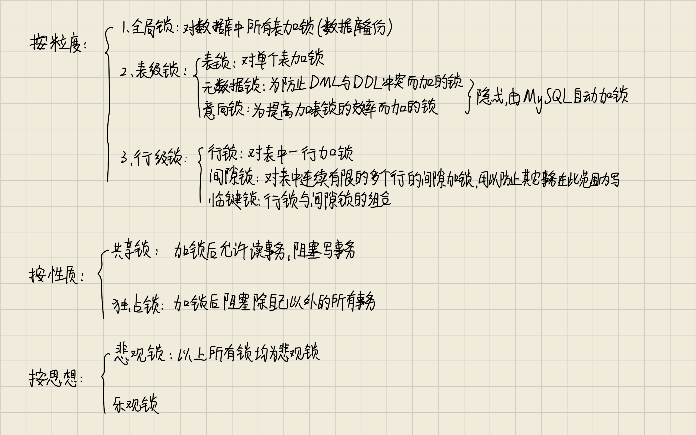

为了保证数据的并发访问和事务的隔离性，InnoDB 中的锁机制主要基于行级锁，但也结合了其他多种锁类型。

## 行级锁

### 记录锁（Record Lock）

锁定某个索引记录，通常用于修改操作，防止其他事务同时更新同一行数据。

### 间隙锁（Gap Lock）
锁定两个相邻记录之间的“间隙”，防止其他事务在该间隙内插入新记录，主要用于解决幻读问题。

### 下一键锁（Next-Key Lock）

是记录锁与间隙锁的组合，即同时锁定某个记录及其前面的间隙（在可重复读隔离级别下默认采用），既保护了已有记录，也防止了新的记录插入导致幻读。

### 插入意向锁（Insert Intention Lock）

这是一种特殊的锁，是对间隙锁的改进。它表明事务打算在某个间隙中插入新记录。多个事务可以对同一间隙同时设置插入意向锁，从而提高并发插入的效率。

## 表级锁-意向锁（Intention Locks）

在表级上，InnoDB 使用意向锁来表示事务对行级锁的申请情况，这种锁主要有两种类型：

- **意向共享锁（IS Lock）**  
    表示事务打算在表中的某些行上加共享锁。
    
- **意向排他锁（IX Lock）**  
    表示事务打算在表中的某些行上加排他锁。
    

意向锁用于快速判断是否存在与当前操作冲突的行锁，并避免对整个表加锁，从而在多个事务竞争时提升性能。

## 共享锁与排他锁

- **共享锁（S Lock）**  
    当事务需要读取数据时，可以加共享锁。共享锁允许其他事务也对同一数据加共享锁，但不允许加排他锁。
    
- **排他锁（X Lock）**  
    当事务需要修改数据时，加排他锁。排他锁会阻止其他事务对同一数据加共享或排他锁，确保数据修改的独占性。
    

## 其他特殊锁

- **自增锁**  
    对于带有自增字段的表，InnoDB 会使用一种特殊的自增锁来保证自增值的连续性和正确性。它通常是一个轻量级的表级锁，防止多个事务在插入新记录时出现竞争。
    
- **元数据锁（MDL）**  
    在进行 DDL 操作（如 ALTER TABLE）时，MySQL 会使用元数据锁来保护表结构，防止数据修改和表结构变更的冲突。
    

## 补充说明

InnoDB 锁机制基于多版本并发控制（MVCC），结合两段锁协议（2PL），既能保证数据的一致性，又能在大部分操作中提供较高的并发性能。不同的锁类型协同工作，既保护了数据不被不当修改，又能最大化地减少锁竞争对系统性能的影响。

在 InnoDB 中，上述所有锁都属于悲观锁，即通过阻塞或等待其他事务释放锁来保证数据一致性。

- **记录锁、间隙锁、下一键锁和插入意向锁**
  都用于防止多个事务同时修改或插入数据的锁，它们会直接阻塞其它事务对同一数据或相邻数据范围的写操作，从而确保数据不会被同时修改，从本质上属于悲观锁。
- **意向锁（IS、IX）**
  用于在表级快速反映事务对行级锁的需求，帮助判断是否存在冲突。意向锁也属于悲观锁，因为它们同样依赖于对锁的申请与阻塞机制来保证数据同步。
- **共享锁（S Lock）与排他锁（X Lock）**
  共享锁允许多个事务同时读取但阻止写操作，而排他锁则确保同一时刻只有一个事务能修改数据，这两种锁都是悲观锁的典型实现。
- **自增锁和元数据锁（MDL）**
  这些特殊锁也是通过阻塞的方式防止并发冲突，确保在插入新记录时或修改表结构时数据的正确性。

而乐观锁在 MySQL 中更多体现在 MVCC 的一致性读实现上，而不依赖实际加锁。