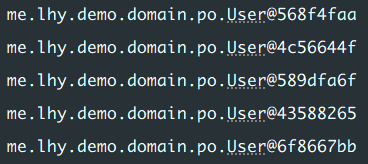

## 使用方法

### 引入依赖

Maven 项目在 `pom.sml` 文件中引入依赖，Spring Boot 3版本如下，boot~~3~~ 即为 2 版本

```xml
<dependency>
    <groupId>com.baomidou</groupId>
    <artifactId>mybatis-plus-spring-boot3-starter</artifactId>
    <version>3.5.9</version>
</dependency>
```
### 配置数据源

在 `application.yml` 文件中添加数据源配置，示例如下：

```yaml
# DataSource Config
spring:
  datasource:
    driver-class-name: com.mysql.cj.jdbc.Driver
    url: jdbc:mysql://${MYSQL_ADDRESS:localhost:3306}/${DATABASE}?serverTimezone=Asia/Shanghai
    username: ${username}
    password: ${password}
```

MySQL的 `url` 串常使用配置：`useSSL=false&serverTimezone=Asia/shanghai&useUnicode=true&characterEncoding=utf8`，意为禁用 SSL，设置时区为 Asia/shanghai，使用 Unicode 字符集和 UTF-8 编码

其中 `${}` 是引用环境变量，方便配置与隐藏密码，而 `MYSQL_ADDRESS:localhost:3306` 则是没有该环境变量时，则使用默认值 `localhost:3306`

### 添加 @MapperScan

完成以上配置后，在项目启动类上添加 `@MapperScan` 注解并指定扫描范围，MP 将在指定的包下扫描 Mapper 接口并自动创建代理对象，示例如下：

```Java
@SpringBootApplication  
@MapperScan("me.lhy.demo.mapper")
public class DemoApplication {
    public static void main(String[] args) {
        SpringApplication.run(DemoApplication.class, args);  
    }
}
```

### BaseMapper

MP 提供了一个基础的泛型接口 `BaseMapper<T>`，为实体类提供了基础的单表 CRUD 方法。示例如下：

```Java
// 实体类
public class User{...}

// Mapper 层中
public interface UserMapper extends BaseMapper<User> {}
```

如此，便可在其他地方使用，如在测试用例中：

```Java
@SpringBootTest  
public class UserMapperTests {  
  
    @Autowired  
    public UserMapper userMapper;  
  
    @Test  
    public void testSelect() {  
        List<User> users = userMapper.selectList(null);  
        users.forEach(System.out::println);  
    }
}
```

输出如下：




## 常用注解

