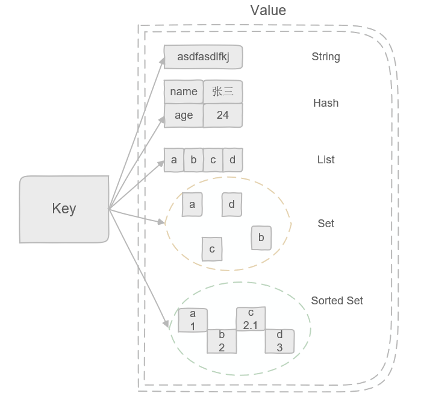

## 五大常用数据类型

Redis 以键值对（Key-Value）的方式存储数据，K 的类型固定为字符串，而 V 则常用为以下数据类型

### 字符串 String

| 命令                                  | 作用                   |
| ----------------------------------- | -------------------- |
| SET key value                       | 设置 key 的值            |
| SETNX key value                     | 若 key 不存在则设置         |
| SETEX key seconds value             | 设置 key 的值并设置过期时间     |
| MSET key1 value1 key2 value2 ...... | 设置一个或多个 key 的值       |
| GET key                             | 获取 key 的值            |
| MGET key1 key2 ......               | 获取一个或多个 key 的值       |
| STRLEN key                          | 返回 key 对应的 value 的长度 |
| INCR key                            | 将 key 中存储的数字加一       |
| DECR key                            | 将 key 中存储的数字减一       |
| EXISTS key                          | 判断 key 是否存在          |
| DEL key                             | 删除 key               |
| EXPIRE key seconds                  | 设置 key 的过期时间         |

### 哈希 Hash

### 列表 List

### 集合 Set

### 有序集合 Sorted Set

