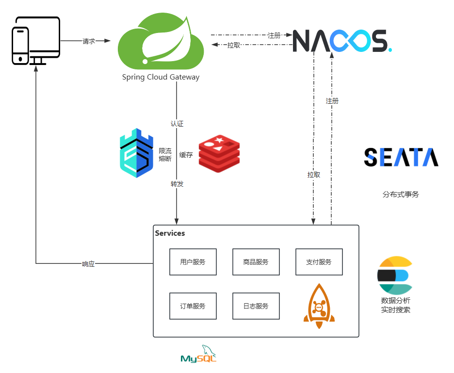
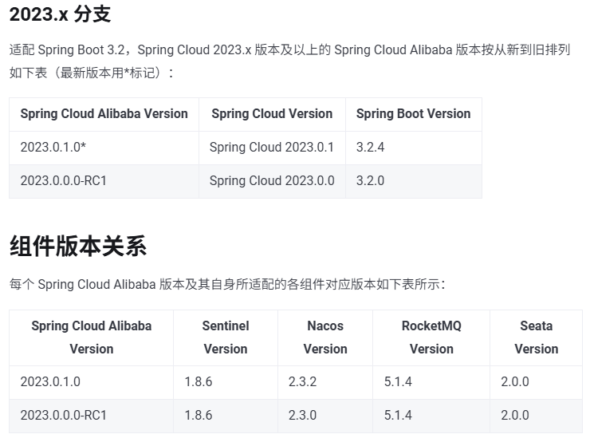
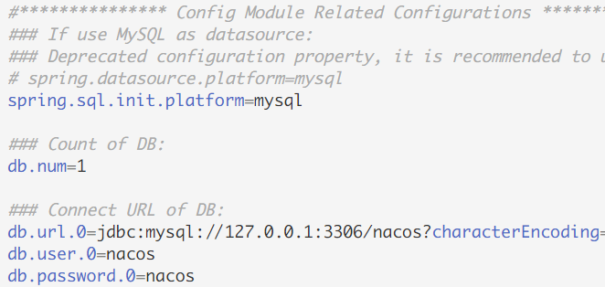

## 项目架构

设计并实现了一个基于 Spring Cloud 微服务架构的电商平台后台系统，支持高并发、高可用，具备商品管理、订单处理、用户管理等核心功能。

### 技术栈

- [Spring Cloud Gateway](https://spring.io/projects/spring-cloud-gateway)：实现统一网关，负责路由转发、权限校验和请求过滤。
- [Nacos](https://nacos.io/)：作为服务注册中心和配置中心，实现服务发现与动态配置管理。
- [Sa-Token](https://sa-token.cc/index.html)：
- [Sentinel](https://sentinelguard.io/)：提供熔断、限流与降级功能，保障系统在高并发场景下的稳定性。
- [Seata](https://seata.apache.org/)：集成分布式事务管理，确保跨服务事务的一致性（如订单支付与库存扣减）。
- [RocketMQ](https://rocketmq.apache.org/)：通过消息队列实现异步处理和削峰填谷（如订单状态更新与库存同步）。
- [Docker](https://www.docker.com/)：对微服务进行容器化部署，提升环境一致性和快速扩展能力。
- [ElasticSearch](https://www.elastic.co/)：提高数据搜索能力，包括日志查询、商品查询、订单查询等。



### 功能模块

- 网关服务（Spring Cloud Gateway + Nacos）
	- [ ] 动态路由：SCG 监听 Nacos 实现动态路由，每当有新的微服务注册到 Nacos 或者现有服务的实例发生变化时，网关能够自动更新其路由表，无需重启服务。
	- [ ] 身份认证：使用 Sa-Token 在网关处同一进行身份认证，确保只有授权用户可以访问特定资源。
	- [ ] 限流与熔断：结合 Sentinel 实现对请求的限流和熔断策略，防止系统过载。
	- [ ] 日志记录：记录所有通过网关的请求信息，便于后续分析和排查问题。
	- [ ] 跨域支持：配置 CORS 政策，使得前端应用可以从不同的域名调用后端 API。
- 用户服务：
	- [ ] 用户管理：包括用户注册、登录、登出、个人信息维护等功能。
	- [ ] 权限管理：实现基于角色的访问控制（RBAC），定义不同角色的权限范围。
	- [ ] 操作记录：收集用户浏览购买等操作信息，便于后续分析
- 商品服务：
	- [ ] 商品管理：支持商品的增删改查操作，包括商品分类、品牌、属性等多条件检索。
	- [ ] 库存管理：实时监控商品库存，支持库存预警机制。
	- [ ] 商品搜索：利用 ElasticSearch 实现高效的商品搜索和过滤功能。
	- [ ] 商品评价：允许用户对已购商品进行评价和打分，提升用户体验。
- 订单服务：
	- [ ] 订单管理：支持商品的增删改查操作，包括订单日期、发起用户、是否完成等多种检索条件。
	- [ ] 生命周期：管理订单的创建、修改、取消、发货、完成等多方面信息
- 日志服务：
	- [ ] 集中式日志管理：采用 Elasticsearch 实现日志的集中收集、存储、查询和可视化。
- 支付服务：
	- [ ] 积分支付：为用户提供积分支付的方式购买商品，模拟支付场景。
	- [ ] 支付接口：集成支付宝、微信、云闪付等支付接口。

### 项目亮点

- **高并发支持**：基于限流、消息队列和负载均衡设计，成功支撑每日百万级请求。
- **高可用设计**：通过动态服务注册发现、熔断限流与分布式事务确保系统可靠性。
- **容器化部署**：通过 Docker 简化微服务部署流程，提高上线效率。


## 项目配置

### 依赖版本

从 [版本发布说明-Spring Cloud Alibaba](https://sca.aliyun.com/docs/2023/overview/version-explain/?spm=5176.29160081.0.0.74805c72PaDKHn) 可知 Spring  Cloud Alibaba（SCA）与其他组件对应的版本，如图所示：



也可在项目 pom.xml 文件中引入某版本的 SCA，随后 `Ctrl + 右键` 查看它定义的依赖版本。

官网和 Github 上的文档更新有一定的滞后性，若需使用最新稳定版本的 SCA，请用第二种方法查看各组件版本。

我这里因为事先已将 Nacos.2.4.2 配置完毕，所以选用了最新的 SCA.2023.0.3.2

### 建立项目

#### 父项目

1. 删除 src 目录
2. 配置 pom.xml 文件，作为配置中心，统一配置和控制依赖版本，内容大致如下：

```xml
...
    <modelVersion>4.0.0</modelVersion>

	<!--删除原来的父项目-->

	<groupId>me.lhy</groupId>  
	<artifactId>malling</artifactId>  
	<version>0.0.1-SNAPSHOT</version>  
	<packaging>pom</packaging>  
	<name>malling</name>  
	<description>malling</description>
    
	<!--删除多余的标签-->

	<!--将子模块添加进来-->  
    <modules>  
        <module>commons</module>
        <!--...--> 
        <module>user-service</module>
    </modules>  
    
	<!--将依赖的版本号定义为属性，方便统一查看管理--> 
    <properties>  
        <java.version>17</java.version>  
        <spring-boot.version>3.2.9</spring-boot.version>  
        <spring-cloud.version>2023.0.3</spring-cloud.version>  
        <spring-cloud-alibaba.version>2023.0.3.2</spring-cloud-alibaba.version>
        ...
    </properties>  

	<!--将所有依赖做好版本声明--> 
    <dependencyManagement>  
        <dependencies>  
            <!--Spring Boot-->  
            <dependency>  
                <groupId>org.springframework.boot</groupId>  
                <artifactId>spring-boot-dependencies</artifactId>  
                <version>${spring-boot.version}</version>  
                <type>pom</type>  
                <scope>import</scope>  
            </dependency>  
            <!--Spring CLoud Alibaba-->  
            <dependency>  
                <groupId>com.alibaba.cloud</groupId>  
                <artifactId>spring-cloud-alibaba-dependencies</artifactId>  
                <version>${spring-cloud-alibaba.version}</version>  
                <type>pom</type>  
                <scope>import</scope>  
            </dependency>  
            <!--Spring Cloud-->  
            <dependency>  
                <groupId>org.springframework.cloud</groupId>  
                <artifactId>spring-cloud-dependencies</artifactId>  
                <version>${spring-cloud.version}</version>  
                <type>pom</type>  
                <scope>import</scope>  
            </dependency>  
            ...
        </dependencies>  
    </dependencyManagement>  

    <!--声明项目的 jdk、maven 版本以及编码格式-->
    <!--通用的 maven 插件配置-->
    <build>  
        <plugins>  
            <plugin>  
                <groupId>org.springframework.boot</groupId>  
                <artifactId>spring-boot-maven-plugin</artifactId>  
            </plugin>
            ...
        </plugins>  
    </build>
</project>
```

#### Commons

作用：存储公用的实体类、工具类，引入公用的依赖

1. 删除启动类和 application.properties 配置文件，否则会覆盖引入了 commons 的其他模块的配置
2. 在 pom.xml 文件声明父项目，引入公用的依赖，示例如下：

```xml
...
<modelVersion>4.0.0</modelVersion>  
<parent>  
    <groupId>me.lhy</groupId>  
    <artifactId>malling</artifactId>
    <version>0.0.1-SNAPSHOT</version>  
</parent>

```


#### Gateway-Service


#### Log-Service


#### Payment-Service


#### Product-Service


#### User-Service


### 配置 Nacos

据 [单机模式部署 | Nacos 官网](https://nacos.io/docs/latest/manual/admin/deployment/deployment-standalone/?spm=5238cd80.2ef5001f.0.0.3f613b7cS62ZDw) 文档所述，执行以下步骤：

1. 下载对应版本的 [alibaba/nacos](https://github.com/alibaba/nacos/releases) 并解压。
2. 创建一个数据库，执行 nacos/conf/mysql-schema.sql 以创建 nacos 所需表。
3. 进入 nacos/conf，编辑 application.properties 文件，将与数据源相关的配置取消注释，并且填上数据库相关信息。



4. 修改 nacos/bin 目录下的 startup.cmd，右键 -> 在记事本中编辑，将 set MODE="cluster" 改为 set MODE="standalone"。也可使用命令行的方式，在当前目录下执行 `startup.cmd -m standalone`。
5. 在欲使用 nacos 的模块的启动类上添加 `@EnableDiscoveryClient`
6. 在模块的 application.yml 中配置 nacos

```yaml
spring:
  application:
    name: xxx
  cloud:
    nacos:
      discovery:
        server-addr: 127.0.0.1:8848
```

我遇到的问题：在正确配置数据源后，启动 nacos 遭遇如下报错：

`Caused by: com.mysql.cj.exceptions.UnableToConnectException: Public Key Retrieval is not allowed`

这是由于 MySQL 8 默认使用 `caching_sha2_password` 身份验证插件，但客户端默认不允许公钥检索，在 application.properties 的数据库连接串后加上 `&allowPublicKeyRetrieval=true` 即可。

### 配置 OpenFeign

1. 在 pom.xml 中添加 spring-cloud-starter-openfeign 依赖
2. 在模块启动类上添加 `@EnableFeignClients`
3. 使用如下：
```java
@FeignClient(name = "receive-service",path = "/receive")
public interface SendService{

	@RequestMapping("/test")
	String test();
}
```

